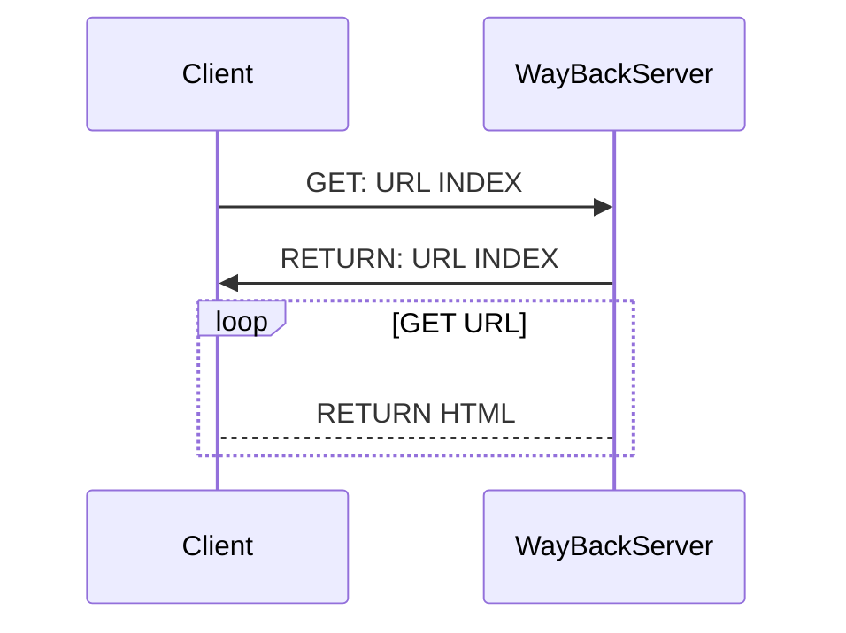

```mermaid
sequenceDiagram
    participant A as Client
    participant B as WayBackServer
    A->>B: GET: URL INDEX
    B->>A: RETURN: URL INDEX
    loop GET URL
        B-->A: RETURN HTML
    end
```